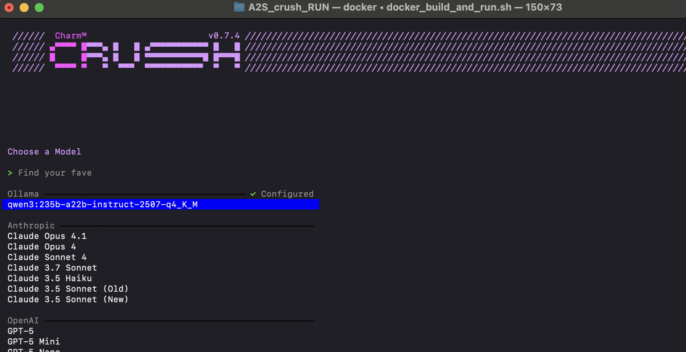

# A2S-AI (Build and Run)

```
git clone https://github.com/a2s-ai/A2S_crush.git

cd A2S_crush/

vi crush.json

daniel@MacBook A2S_crush % cat crush.json
{
  "providers": {
    "ollama": {
      "name": "Ollama",
      "base_url": "https://XXX-XXX-XXX-XXX/v1/",
      "type": "openai",
      "models": [
        {
          "name": "qwen3:235b-a22b-instruct-2507-q4_K_M",
          "id": "qwen3:235b-a22b-instruct-2507-q4_K_M",
          "context_window": 20480,
          "default_max_tokens": 4096
        }
      ]
    }
  }
}
daniel@MacBook A2S_crush %
```

```
./docker_build_and_run.sh
```



# A2S GPU Server

* Ubuntu 24 LTS VM with 4 x NVIDIA RTX 6000A

## Ollama (Docker) Settings with 20k Context

```
root@ai-ubuntu24gpu-large:~# cat /opt/run-ollama-max.sh
#!/bin/sh

export HUGGING_FACE_HUB_TOKEN=hf_XXX-XXX-XXX
export CUDA_VISIBLE_DEVICES="0,1,2,3"

docker run \
       --name ollama-max \
       --network ollama-max \
       --gpus='"device=0,1,2,3"' \
       --runtime=nvidia \
       --shm-size=8g \
       -p 11434:11434 \
       --rm --init \
       -e OLLAMA_HOME=/ollama-data \
       -v /data/opt/ollama:/ollama-data \
       -v /data/opt/ollama:/root/.ollama \
       -e OLLAMA_KEEP_ALIVE=-1 \
       -e OLLAMA_MAX_LOADED_MODELS=1 \
       -e OLLAMA_NUM_PARALLEL=1 \
       -e OLLAMA_MAX_QUEUE=512 \
       -e OLLAMA_ORIGINS="*" \
       -e OLLAMA_DEBUG=0 \
       -e OLLAMA_NUM_GPU_LAYERS=9999 \
       -e OLLAMA_DISABLE_CPU=1 \
       -e OLLAMA_LOAD_TIMEOUT=600 \
       -e OLLAMA_CONTEXT_LENGTH=20480 \
       ollama/ollama:latest

# EOF
root@ai-ubuntu24gpu-large:~#
```

